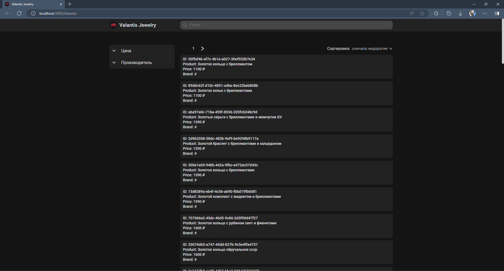

# Valantis Jewelry Store

Hi there! My name is Matvey Molchanov! This is a Valantis repo for a job test task.

- [About the app](#about-the-app)
- [Branches](#branches)
- [Technology Stack](#technology-stack)
- [System Requirements](#system-requirements)
- [Setup](#setup)
- [Running the app](#running-the-app)

## About the app

This app is a jewelry store, where you can filter products by price and vendor, sort them by price increase and decrease. Also you can filter products by its name via search bar.
App has fully adaptive design, works properly on mobiles, tablets and PCs

## Branches

This project has 2 branches:

- main
- gh-pages (branch to host this app on [GitHub Pages](https://pages.github.com/))

## Technology Stack

- Feature Sliced Design
- Typescript
- React
- Redux ToolKit
- RTK Query
- Material UI (for product card placeholder)
- ESLint
- Webpack

## System Requirements

- [[node]](https://nodejs.org/en) v21.5.0 or greater
- [[npm]](https://www.npmjs.com/) v10.2.4 or greater

All of these must be available in your `PATH`. To verify things are set up
properly, you can run this:

```
node --version
npm --version
```

## Setup

After you've made sure to have the correct things (and versions) installed, you
should be able to just run a few commands to get set up:

```
git clone https://github.com/mut4bor/Valantis.git
cd Valantis
npm i
```

Before running the app, add your api key in the .env file like this:

```
REACT_APP_AUTH_TOKEN=<your_api_key>
```

## Running the app

To get the app up and running (and really see if it worked), run:

```shell
npm start
```

Your browser should open up automatically to
`http://localhost:3000/Valantis` (if it doesn't, just open that yourself) and you should
be able to start messing around with the app.

Here's what you should be looking at:


